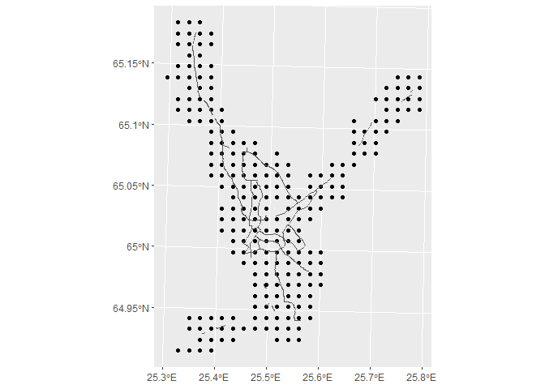
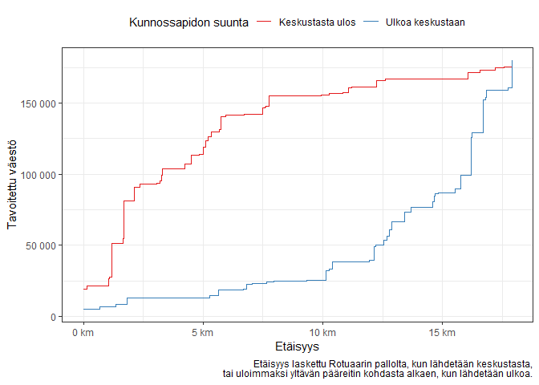

Kunnossapidon optimisuunta
================
Pasi Haapakorva
Tue Feb 12 20:37:49 2019

``` r
library(tidyverse)
library(sf)
library(here)

rotuaari <- st_read(here("shp", "rotuaarin_pallo.shp")) %>% st_set_crs(3067)
```

    ## Reading layer `rotuaarin_pallo' from data source `C:\Users\pasih\Documents\analyysit\kunnossapitosuunta\shp\rotuaarin_pallo.shp' using driver `ESRI Shapefile'
    ## Simple feature collection with 1 feature and 1 field
    ## geometry type:  POINT
    ## dimension:      XY
    ## bbox:           xmin: 427943 ymin: 7210686 xmax: 427943 ymax: 7210686
    ## epsg (SRID):    NA
    ## proj4string:    +proj=utm +zone=35 +ellps=GRS80 +units=m +no_defs

``` r
paareitit <- st_read(here("shp", "paareitit_fixed.shp")) %>% st_set_crs(3067)
```

    ## Reading layer `paareitit_fixed' from data source `C:\Users\pasih\Documents\analyysit\kunnossapitosuunta\shp\paareitit_fixed.shp' using driver `ESRI Shapefile'
    ## Simple feature collection with 3880 features and 3 fields
    ## geometry type:  LINESTRING
    ## dimension:      XY
    ## bbox:           xmin: 422311.8 ymin: 7201543 xmax: 442384.9 ymax: 7229018
    ## epsg (SRID):    NA
    ## proj4string:    +proj=utm +zone=35 +ellps=GRS80 +units=m +no_defs

``` r
ruudut <- st_read(here("shp", "ruudut.shp")) %>% st_set_crs(3067)
```

    ## Reading layer `ruudut' from data source `C:\Users\pasih\Documents\analyysit\kunnossapitosuunta\shp\ruudut.shp' using driver `ESRI Shapefile'
    ## Simple feature collection with 99528 features and 13 fields
    ## geometry type:  POLYGON
    ## dimension:      XY
    ## bbox:           xmin: 85000 ymin: 6629000 xmax: 725000 ymax: 7777000
    ## epsg (SRID):    NA
    ## proj4string:    +proj=utm +zone=35 +ellps=GRS80 +units=m +no_defs

``` r
# liitetään ruudut pääreitteihin
ruutu_join <- paareitit %>%
  st_buffer(1500) %>%
  st_join(ruudut)

# piirretään simppeli kuva
ruutu_join %>%
  st_set_geometry(NULL) %>%
  distinct(id_nro, .keep_all = TRUE) %>%
  st_as_sf(coords = c("xkoord", "ykoord")) %>%
  st_set_crs(3067) %>%
  ggplot() +
  geom_sf() +
  geom_sf(data = paareitit %>% st_simplify)
```

<!-- -->

``` r
# lasketaan ruuduista etäisyys rotuaarille
rotuaari_dist <- ruutu_join %>%
  st_distance(rotuaari) %>%
  as.numeric() %>%
  enframe(name = NULL, value = "distance")

# poistetaan ruutudatasta geometria ja liitetään etäisyys
ruutu_dist <- ruutu_join %>%
  st_set_geometry(NULL) %>%
  as_tibble() %>%
  bind_cols(rotuaari_dist)

# lasketaan väestön kumuloituminen kahteen eri suuntaan
cum_dist <- ruutu_dist %>%
  distinct(id_nro, .keep_all = TRUE) %>%
  group_by(distance) %>%
  summarise(vaesto = sum(vaesto)) %>%
  mutate(peri_dist = max(distance) - distance) %>%
  mutate(kesk_vaesto = cumsum(vaesto)) %>%
  arrange(peri_dist) %>%
  mutate(peri_vaesto = cumsum(vaesto))

# piirretään kuva
cum_dist %>%
  select(contains("dist"), contains("_vaesto")) %>%
  ggplot(aes(distance, kesk_vaesto)) +
  geom_step(aes(color = "Keskustasta ulos")) +
  geom_step(aes(peri_dist, peri_vaesto, color = "Ulkoa keskustaan")) +
  scale_color_brewer(palette = "Set1", name = "Kunnossapidon suunta") +
  scale_x_continuous(labels = function(x) paste(x / 1000, "km")) +
  scale_y_continuous(labels = function(x) format(x, big.mark = " ")) +
  labs(x = "Etäisyys", y = "Tavoitettu väestö",
       caption = "Etäisyys laskettu Rotuaarin pallolta, kun lähdetään keskustasta,
       tai uloimmaksi yltävän pääreitin kohdasta alkaen, kun lähdetään ulkoa.") +
  theme_bw() +
  theme(legend.position = "top")
```

<!-- -->

``` r
ggsave(here("fig", "kuva.png"))
```
